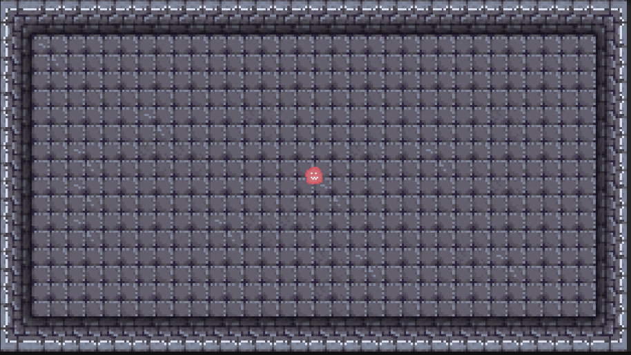

# 🐸 froglike

> A pixel-art roguelike game featuring a brave little frog on a big adventure.  
> *Jump, fight, and croak your way through procedurally generated challenges.*

---

## 🎮 About the Game

**froglike** is a roguelike/roguelite game project, inspired by classic dungeon crawlers and modern indie roguelikes.  
It features:
- 🐸 A frog protagonist with unique movement and combat mechanics
- 🌀 Procedurally generated levels
- 🧪 Randomly generated items and upgrades
- 🎨 Pixel art style

Currently in **early development**

---

## 🛠️ Technologies Used

- Unity
- Aseprite
- C#
- Fl studio/Audacity

---

## 📅 Development Status

This project just started.
Planned next steps:
- [ ] 💻 Creating dynamic boundries to levels
- [ ] 💻 Basic attack ability
- [ ] 💻 First enemy prototyp
- [ ] 🎨 Creating tileset for a level

---

## 📬 Contact

If you're curious about the project or want to collaborate, reach out:  
📧 kstajniak42@gmail.com  
🐸 Or open an issue here on GitHub!

---

## 📄 License

This project is under a custom non-commercial license.  
See the [LICENSE](./LICENSE) file for details.
